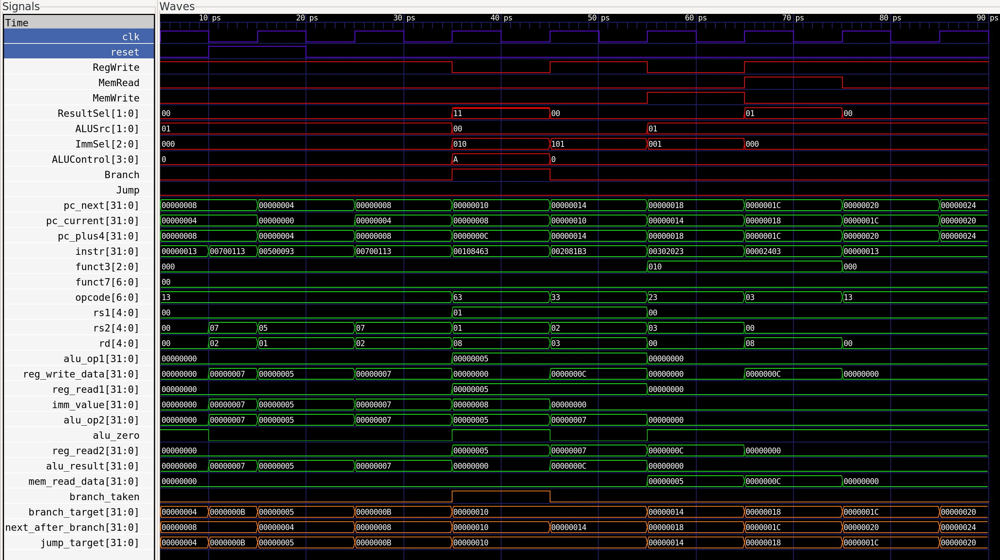

# RV32I Single-Cycle Baseline Processor

<p align="center"></p>
<p align="center"></p>

## I. Supported Commands

This baseline processor supports a specific subset of the RISC-V ISA

| Instruction Class | Supported Instructions |
| :--- | :--- |
| **R-type** | `add`, `sub`, `and`, `or`, `xor`, `sll`, `srl`, `sra`, `slt`, `sltu` |
| **I-type** | `addi`, `andi`, `ori`, `xori`, `slli`, `srli`, `srai`, `slti`, `sltiu` |
| **Memory** | `lw`, `sw` |
| **Branches** | `beq`, `bne`, `blt`, `bge` |
| **Jump** | `jal` |

## II. Implemented Modules

* `adder.sv`
* `alu.sv`
* `branch_unit.sv`
* `control_unit.sv`
* `data_mem.sv`
* `imm_gen.sv`
* `instr_mem.sv`
* `instr_parser.sv`
* `mux2.sv`
* `pc.sv`
* `regfile.sv`
* `single_cycle_top.sv`
* `testbench.sv`

## III. Known Limitations

* This work only supports a limited subset of RISC-V instructions. Notably, U-type instructions and `jalr` are not supported.
* Although this project aims for synthesizable code, the current single-cycle design is unoptimized and will definitely destroy the timing closure of any physical implementation.

## IV. Design Philosophy

This work serves as a fundamental baseline design. It will require further pipelining and extensive PPA (Power, Performance, Area) optimization to meet real-world implementation demands.

## V. Verification

The datapath is verified using the following program

```text
00500093 // addi x1(ra), x0(zero), 5
00700113 // addi x2(sp), x0(zero), 7
00108463 // beq  x1(ra), x1(ra), 8
06300193 // addi x3(gp), x0(zero), 99
002081b3 // add  x3(gp), x1(ra), x2(sp)
00302023 // sw   x3(gp), 0(x0)
00002403 // sw   x0(zero), 0(x0)
00000013 // addi x0(zero), x0(zero), 0
```

``` bash
$ ./obj_dir/Vtestbench # check
         5
         7
        12
        12
         0
- testbench.sv:52: Verilog $finish
```
